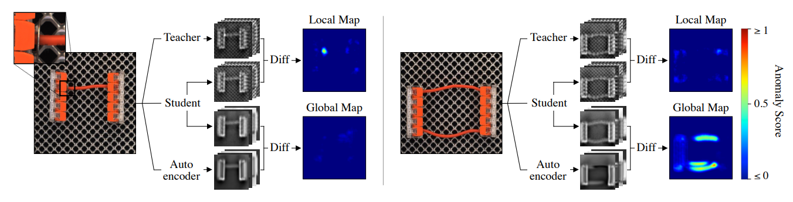

# EfficientAD
This repository offers an unofficial implementation of [EfficientAD: Accurate Visual Anomaly Detection at Millisecond-Level Latencies](https://arxiv.org/abs/2303.14535). It offers scripts for training, evaluation, and real-time inference on image, video, and streams.

<div style="display: grid; grid-template-columns: 1fr; justify-items: center">
  
</div>

## Main Features
- **Unsupervised Anomaly Detection** with [**EfficientAD**](https://github.com/nelson1425/EfficientAD).
- **Tracking** with [**SORT**](https://github.com/abewley/sort) with angular speed adjustments.

## Quick Start
Before you begin, ensure your system meets the following requirements if you intend to:

### Docker
- [**NVIDIA Container Toolkit**](https://docs.nvidia.com/datacenter/cloud-native/container-toolkit/latest/install-guide.html) (required)

#### > Pull Image (CUDA==12.9)
```bash
make pull
```

#### > Build Image (All CUDAs)
```bash
make build
```

#### Start
```
make up
make exec
```


## Structure
### > Dataset
```python
└─ dataset-example
   ├─ train
   │  └─ normal
   │     ├─ normal-000.png
   │     │      ...
   │     └─ normal-199.png
   │
   └─ test
      ├─ normal
      │  ├─ normal-200.png
      │  │      ...
      │  └─ normal-249.png
      └─ abnormal
         ├─ abnormal-000.png
         ├─ abnormal-000.txt     # (Optional): Annotations in YOLO format (bbox or polygon) for AU-PRO
         │      ...
         ├─ abnormal-049.png
         └─ abnormal-049.txt
```

### > Config
#### Train (e.g. config/train/config.yml)

```yaml
seed: 42                                            # Allow reproducibility

dataset:
  path: "data/dataset/"                             # Dataset path
  roi: "1009:499:1551:920"                          # W:H:x0:y0
  pre_transform: True                               # Generate cropped dataset for speed

  norm_mean: [0.485, 0.456, 0.406]
  norm_std: [0.229, 0.224, 0.225]

  batch_size: 1                                     # Batch size (default=1)
  workers: 12                                       # Use the number of CPU threads you have 

  train:                                            # Toggle the desired data augmentation
    crop: False
    hflip: False
    vflip: False
    rotate: False
    translation: False
    grayscale: False
    jitter: False
    blur: False

trainer:
  steps: 150000                                     # Number of steps
  transform_steps: 120000                           # Apply data augmentation until step N
  test_freq_steps: 5000                             # Test performance every N steps
  lr: 0.0001                                        # Learning rate (default=0.0001)
  wd: 0.00001                                       # Weight decay (default=0.00001)
  lr_scheduler:                                     # LR Scheduler: [StepLR, ExponentialLR, 
                                                    # CosineAnnealingLR, CosineAnnealingWarmRestarts]
    type: "StepLR"
    kwargs:
      step_size: 100000
      gamma: 0.1

net:
  input_size: 256                                         # Network input size (default=256)
  type: "small"                                           # Network type [small, medium]
  teacher_weights: "models/pdn_s_wideresnet101_2.pth"     # Teacher weights
  out_channels: 384                                       # Output channels (default=384)

saver:
  exp_path: "results/test"                                # Results output path
```

#### Inference (e.g. config/inference/config.json)
```yml
{
  "sources": [
    {
      "id": 0,
      "rois": {
        "892:660:1045:0": [
          {
            "id": 2,                                                   # ROI ID
            "path": "models/efficientad_tensorrt_roi2.pt",             # Export Model (ir=torchscript)
            "input_size": [256, 256],                                  # Network input size
            "params": {                                                # Params
              "combined_map_threshold": 0.25
            }
          }
        ],
        # ... more rois in video source
      }
    },
    # ... more video sources
  ],

  "params": {                                                        # Tracking params
    "tracker_iou_threshold": 0.15,
    "tracker_min_hits": 3,
    "tracker_max_age": 3
  }
}
```

## Examples

### 🚀 Train
```
python train.py --config config/train/config.yml
```

**Arguments:**
- ***--config:*** Training configuration file

<br>

**(Optional) Tensorboard Logs**

```bash
tensorboard --host 0.0.0.0 --logdir logs
```

<br>

### 📊 Evaluation

```
python eval.py --results results/... --dataset data/...
```
**Arguments:**
- ***--results:*** Path to the model results.
- ***--dataset:*** Path to the evaluation dataset.

<br>

### 📦 Export Model

```
python export.py --results results/... --device <device> --type <type>
```
**Arguments:**

- ***--results:*** Path to the model results.
- ***--device:*** Target device for export (`cpu` or `cuda`).
- ***--type:*** Export format and precision (e.g., `pytorch-fp32`, `torchscript-fp32`, `onnx-fp32`, `tensorrt-fp32`, `tensorrt-fp16`).
- ***--verbose:*** Enable verbose logging.

<br>

### 🎥 Inference

```
python inference.py --config config/inference/config.json --camX <rtsp_stream> [--with-vis] [--with-rec]
```

**Arguments:**
- ***--config:*** Path to the inference configuration file.
- ***--camX:*** Input stream(s), such as RTSP camera URLs (e.g., --cam0 rtsp://...).
- ***--vis (optional):*** Enable live view during inference.
- ***--rec (optional):*** Enable recording during inference.
